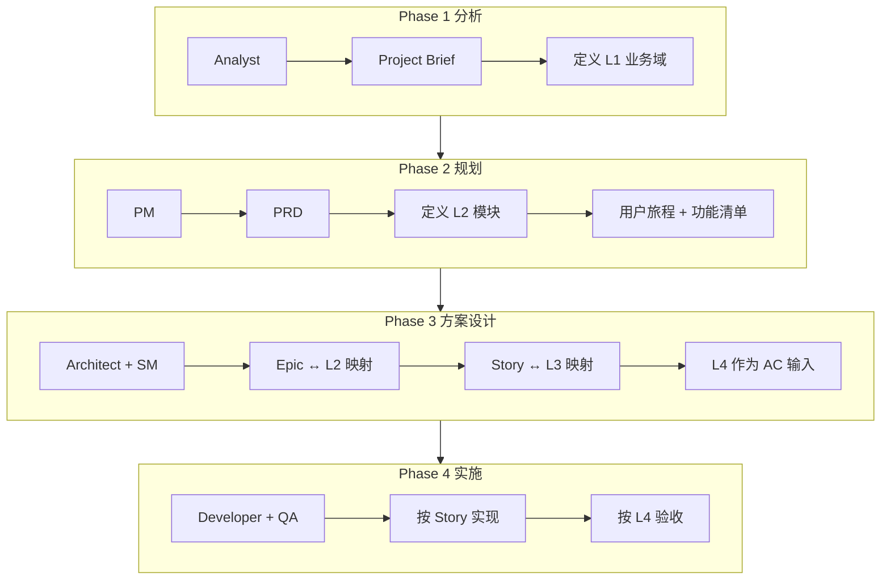

# BAM 融合方法论

> ⚠️ **已深度融合**：本文档内容已并入 [01-方法论](01-方法论.md)、[04-Architecture](04-Architecture.md)。建议从 [01-方法论](01-方法论.md) 开始阅读。

---

> **BAM** = **B**MAD + **A**rchitecture（业务架构）**M**ethod  
> 将 BMAD 敏捷开发流程与四级业务架构流程融合，形成「业务→需求→交付」全链路可追溯的方法体系。参考 BIZBOK、TOGAF 等业务/企业架构框架。
>
> 📄 **导入到项目**：见 [BAM 导入指南](../tools/BAM-导入指南.md)  
> 📄 **完整发现→交付流程**：见 [01-方法论](01-方法论.md)

---

## 一、方法概述

### 1.1 融合来源

| 来源 | 核心结构 | 视角 |
|------|----------|------|
| **BMAD** | Phase 1 分析 → Phase 2 规划 → Phase 3 方案设计 → Phase 4 实施 | 开发/交付（怎么交付） |
| **业务架构** | 一级 → 二级 → 三级 → 四级 | 业务/功能（交付什么） |
| **BIZBOK** | 能力地图、价值流、举措地图等 | 业务架构建模标准 |
| **TOGAF** | 业务→应用→数据→技术架构 | 企业架构全链路 |

### 1.2 融合映射

```
REQ（需求）→ L1（一级域）→ L2（二级模块）→ Epic → Story → L3（业务动作）→ L4（业务步骤/AC）
```

| BMAD 阶段 | 业务架构层级 | 产出物 |
|-----------|--------------|--------|
| **Phase 1 分析** | L1 一级业务流程 | Project Brief、业务域定义 |
| **Phase 2 规划** | L2 二级业务流程 | PRD、用户旅程、功能模块 |
| **Phase 3 方案设计** | Epic↔L2；Story↔L3 | 架构、Epic、Story、L3 映射 |
| **Phase 4 实施** | L4 业务步骤 | AC 细化、代码、测试 |

---

## 二、核心概念

### 2.1 业务架构四级

| 层级 | 名称 | 定义 | 对应 BMAD |
|------|------|------|-----------|
| **L1** | 一级业务流程 | 业务域 / 主流程，顶层业务闭环 | Phase 1 产出 |
| **L2** | 二级业务流程 | 子流程 / 功能模块，对应页面或业务板块 | Phase 2 PRD 功能清单 |
| **L3** | 三级业务动作 | 用户可感知的任务步骤 | Phase 3 Story |
| **L4** | 四级业务步骤 | 具体选项、分支或步骤 | Phase 4 AC |

### 2.2 映射规则

| 映射 | 规则 | 示例 |
|------|------|------|
| **REQ → L1** | 需求归属业务域 | REQ-002 评估 → L1-01 核心业务域 |
| **L1 → L2** | 一级域包含若干二级模块 | L1-01 → 分析、诊断、评估、布局 |
| **L2 ↔ Epic** | 二级模块与 Epic 一一或一对多 | L2-03 评估 ↔ EPIC-2 评估能力 |
| **Story ↔ L3** | 用户故事对应三级业务动作 | S2.1 价值评估 ↔ L3-03-02 选择场景 |
| **L4 → AC** | 四级步骤作为 Story 验收标准 | 选择「选项A」→ Given/When/Then |

---

## 三、BAM 工作流

### 3.1 四阶段流程



### 3.2 各阶段检查清单

| 阶段 | 角色 | 必做项 | 产出 |
|------|------|--------|------|
| **Phase 1** | Analyst | 项目定位、市场验证、范围边界、**L1 业务域列表** | Project Brief |
| **Phase 2** | PM | 用户旅程、功能清单、**L2 模块列表**、REQ 与 L2 映射 | PRD |
| **Phase 3** | Architect + SM | Epic 划分、**Epic↔L2**、**Story↔L3**、**L4 作为 AC** | 架构、Epic、Story |
| **Phase 4** | Dev + QA | 按 Story 迭代、按 L4 验收、质量门禁 | 代码、测试 |

---

## 四、工具与模板

| 工具 | 说明 |
|------|------|
| [BAM 追溯矩阵](../tools/BAM-追溯矩阵.html) | 全链路可视化 |
| [BAM-追溯矩阵-模板.json](../tools/BAM-追溯矩阵-模板.json) | 新项目初始化 |
| [BAM 导入指南](../tools/BAM-导入指南.md) | 复用步骤 |
| [BAM 工作流检查清单](../tools/BAM-工作流检查清单.md) | 各 Phase 自检 |

**打开追溯矩阵**：在 `tools` 目录执行 `npx serve . -p 3789`，访问 `http://localhost:3789/BAM-追溯矩阵.html`

---

## 五、适用场景

| 场景 | 建议 |
|------|------|
| **新项目启动** | 从 Phase 1 开始，同步建立 L1/L2 结构 |
| **需求变更** | 更新 REQ → 追溯 L2/Epic/Story → 评估影响范围 |
| **Story 拆解** | 从 L3 业务动作出发，L4 作为 AC 细化 |
| **验收测试** | 按 L4 步骤逐项验证 |
| **范围蔓延检测** | 新增需求是否在 L1 边界内，否则升级规划 |

---

## 六、AI 时代：追溯矩阵的价值

- **结构化上下文**：L1/L2/L3/L4 + 追溯链 = AI 可理解的业务地图
- **影响分析**：AI 可基于追溯矩阵做变更影响分析、依赖推荐
- **自动同步**：需求/Story 变更时，AI 可辅助更新追溯链、补全遗漏
- **Agent 协作**：BMAD 等 Agent 可基于追溯矩阵理解「改哪里、影响谁」

---

*BAM 方法论随项目实践持续迭代*
